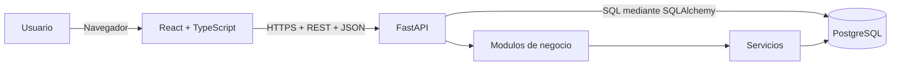
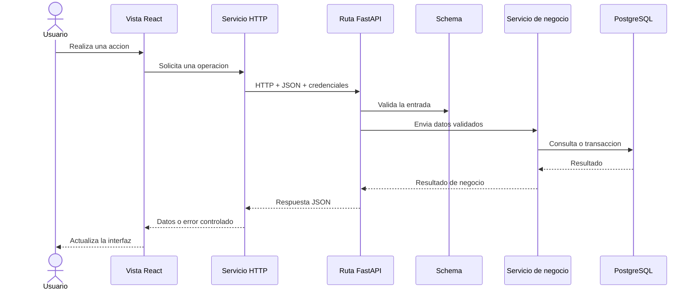

# Fase 02 - Arquitectura tecnica

## 1. Control del documento

| Campo | Valor |
| --- | --- |
| Proyecto | SalesIA Enterprise |
| Fase | 02 - Arquitectura tecnica |
| Documento | Arquitectura general |
| Alcance | Primera version del sistema |
| Estado | Definido |
| Requisito de origen | Fase 01 - Analisis y levantamiento |

## 2. Proposito

Este documento define como se organizara SalesIA Enterprise y como se
comunicaran sus componentes. Establece limites y responsabilidades antes de
diseñar pantallas, tablas o endpoints completos.

La primera version utiliza una arquitectura de monolito modular: el frontend y
el backend se despliegan como aplicaciones separadas, mientras que el backend
mantiene sus funciones de negocio dentro de una sola aplicacion organizada por
modulos.

Esta eleccion reduce la complejidad inicial y permite separar modulos en el
futuro si existe una necesidad comprobada.

## 3. Vista general



### 3.1 Frontend

React presenta las pantallas, administra la navegacion y valida los formularios
para ofrecer retroalimentacion inmediata. Toda operacion que modifique o
consulte datos persistentes se realiza mediante la API.

El frontend no contiene reglas definitivas de negocio. Aunque valide un dato,
el backend debe volver a validarlo.

### 3.2 Backend

FastAPI expone una API REST, autentica al usuario, verifica permisos, valida las
entradas y ejecuta las reglas de negocio. Tambien coordina las transacciones con
la base de datos.

El backend es la unica aplicacion autorizada para acceder directamente a
PostgreSQL.

### 3.3 Base de datos

PostgreSQL conserva usuarios, clientes, productos, existencias, movimientos,
ventas y pagos. La base de datos protege relaciones, restricciones e integridad
de la informacion.

El modelo entidad-relacion, las tablas y los indices se diseñaran en la fase 04.

## 4. Estilo arquitectonico

SalesIA Enterprise seguira estos principios:

- Monolito modular para la primera version.
- Frontend y backend separados.
- API REST con datos JSON.
- PostgreSQL como unica base de datos operacional.
- Separacion entre transporte HTTP, validacion, negocio y persistencia.
- Una transaccion para operaciones que deben completarse juntas.
- Configuracion mediante variables de entorno.
- Dependencias dirigidas desde las capas externas hacia las internas.
- Modulos futuros aislados de los procesos comerciales iniciales.

La primera version no utilizara microservicios, colas de mensajes, una base de
datos analitica separada ni comunicacion directa entre React y PostgreSQL.

## 5. Flujo general de una solicitud



El flujo no debe saltarse el servicio para operaciones con reglas de negocio.
Las rutas pueden delegar consultas simples, pero no deben contener calculos de
ventas, control de stock ni transacciones.

## 6. Arquitectura del backend

```text
backend/app/
├── api/
│   ├── router.py
│   └── routes/
│       ├── auth.py
│       ├── customers.py
│       ├── products.py
│       ├── inventory.py
│       ├── sales.py
│       └── dashboard.py
├── core/
│   ├── config.py
│   ├── security.py
│   └── exceptions.py
├── db/
│   ├── base.py
│   └── session.py
├── models/
├── schemas/
├── services/
├── statistics/
├── probability/
├── insights/
├── reports/
└── main.py
```

### 6.1 Responsabilidades

| Carpeta o archivo | Responsabilidad |
| --- | --- |
| `main.py` | Crear FastAPI, registrar configuracion global y conectar routers. |
| `api/router.py` | Reunir las rutas publicadas por la API. |
| `api/routes` | Recibir solicitudes HTTP, comprobar acceso y devolver respuestas. |
| `core/config.py` | Leer y exponer la configuracion de la aplicacion. |
| `core/security.py` | Contener utilidades de autenticacion y autorizacion. |
| `core/exceptions.py` | Definir errores controlados de aplicacion. |
| `db/session.py` | Crear la conexion y las sesiones de base de datos. |
| `db/base.py` | Mantener el registro base de modelos SQLAlchemy. |
| `models` | Representar las entidades persistentes. |
| `schemas` | Validar datos de entrada y definir respuestas de la API. |
| `services` | Ejecutar reglas de negocio y coordinar transacciones. |
| `statistics` | Alojar calculos estadisticos cuando se implemente la fase 09. |
| `probability` | Alojar probabilidad y Bayes cuando corresponda. |
| `insights` | Generar observaciones explicables en la fase 11. |
| `reports` | Generar reportes en la fase 12. |

### 6.2 Reglas de dependencia

- Las rutas pueden depender de schemas, servicios y componentes de `core`.
- Los servicios pueden depender de modelos y de sesiones de base de datos.
- Los schemas no dependen de las rutas.
- Los modelos no conocen HTTP ni componentes de la interfaz.
- Ningun modulo debe importar codigo del frontend.
- Los modulos estadisticos consumiran datos mediante servicios definidos, no
  mediante acceso desordenado desde las rutas.

## 7. Arquitectura del frontend

La estructura prevista es:

```text
frontend/src/
├── app/
├── components/
├── layouts/
├── modules/
│   ├── auth/
│   ├── customers/
│   ├── products/
│   ├── inventory/
│   ├── sales/
│   └── dashboard/
├── services/
├── hooks/
├── types/
└── utils/
```

| Carpeta | Responsabilidad |
| --- | --- |
| `app` | Inicializacion, proveedores y definicion principal de rutas. |
| `components` | Componentes visuales reutilizables y sin reglas de dominio. |
| `layouts` | Estructuras compartidas como menu, cabecera y contenido. |
| `modules` | Pantallas, componentes y logica de interfaz de cada dominio. |
| `services` | Cliente HTTP y comunicacion con FastAPI. |
| `hooks` | Comportamientos reutilizables de React. |
| `types` | Tipos TypeScript compartidos. |
| `utils` | Funciones auxiliares sin estado ni reglas comerciales. |

La aplicacion React y sus dependencias se crearan en la fase 06. La fase 02 solo
define su organizacion. La navegacion visual, wireframes y sistema de diseño
pertenecen a la fase 03.

## 8. Modulos de la primera version

| Modulo | Responsabilidad inicial |
| --- | --- |
| Autenticacion | Iniciar sesion e identificar al usuario y su rol. |
| Usuarios | Administrar usuarios, roles y estado de acceso. |
| Clientes | Gestionar personas y empresas registradas. |
| Productos | Gestionar catalogo, categorias, precios y estado. |
| Inventario | Consultar stock y registrar movimientos. |
| Ventas | Registrar venta, detalles, pago y salida de inventario. |
| Dashboard | Consultar indicadores comerciales basicos. |

Usuarios puede compartir inicialmente el area tecnica de autenticacion. Si su
alcance crece, tendra rutas y servicios propios sin cambiar la arquitectura.

## 9. Modulos reservados

Los siguientes modulos no participan en el flujo inicial:

| Modulo | Fase prevista |
| --- | --- |
| Pedidos | Evolucion posterior al flujo inicial de ventas. |
| Estadistica | Fase 09. |
| Probabilidad | Fase 09. |
| Analytics | Fases 09 y 10. |
| Insights | Fase 11. |
| Reportes avanzados | Fase 12. |
| Auditoria completa | Fase 13. |

Sus carpetas pueden conservarse vacias como reserva estructural. No deben recibir
implementaciones parciales antes de la fase correspondiente.

## 10. Comunicacion entre componentes

### 10.1 API

- La API utilizara el prefijo `/api/v1`.
- Las solicitudes y respuestas utilizaran JSON.
- El frontend enviara credenciales mediante el encabezado `Authorization`.
- Los endpoints protegidos verificaran usuario activo y rol permitido.
- Las respuestas de error tendran una estructura comun.
- La especificacion detallada de endpoints se completara dentro de la fase 02.

### 10.2 Persistencia

- Se utilizara SQLAlchemy 2 para el acceso a PostgreSQL.
- Se utilizara Alembic para controlar las migraciones.
- La primera version usara sesiones sincronicas para mantener una implementacion
  sencilla y predecible.
- Cada solicitud que use la base de datos recibira una sesion controlada.
- Una transaccion confirmara o revertira conjuntamente venta, detalles, pago y
  movimientos de inventario.

Estas decisiones se implementaran en la fase 04 para persistencia y en la fase
05 para servicios y endpoints.

### 10.3 Fechas y moneda

- Los importes se manejaran en PEN durante la primera version.
- Las fechas se almacenaran de forma consistente y se presentaran en la zona
  horaria `America/Lima`.
- La precision monetaria se definira con tipos decimales en el modelo de datos.

## 11. Configuracion y ambientes

La arquitectura contempla tres ambientes:

- `development`: trabajo local.
- `test`: pruebas automatizadas con datos aislados.
- `production`: ejecucion publicada con secretos externos al repositorio.

Las direcciones, credenciales, claves y opciones variables se proporcionaran por
variables de entorno. Los archivos `.env` locales no se guardaran en Git. El
archivo `.env.example` documentara los nombres requeridos sin incluir secretos.

La configuracion concreta de despliegue se realizara en la fase 15.

## 12. Limites entre fases

| Decision de arquitectura en fase 02 | Implementacion correspondiente |
| --- | --- |
| Estructura del frontend | Interfaz visual en fase 03 y React en fase 06. |
| SQLAlchemy, sesiones y Alembic | Modelo y migraciones en fase 04. |
| Contratos REST | Endpoints y servicios en fase 05. |
| Autenticacion basada en token y roles | Implementacion en fase 05 y refuerzo en fase 13. |
| Flujo transaccional de venta | Implementacion comercial en fase 08. |
| Limites de Analytics | Motor en fase 09 y dashboard en fase 10. |
| Ambientes previstos | Despliegue en fase 15. |

## 13. Decisiones pendientes dentro de la fase 02

Para cerrar completamente la fase 02 todavia deben documentarse:

1. Contratos iniciales de la API.
2. Estrategia detallada de autenticacion y permisos.
3. Formato comun de respuestas y errores.
4. Convenciones de nombres, filtros y paginacion.
5. Variables requeridas por cada ambiente.
6. Versiones y dependencias que se fijaran al iniciar backend y frontend.

Estos puntos son definiciones. No requieren crear tablas, formularios ni logica
de negocio en esta fase.

## 14. Criterios de aceptacion del documento

- La relacion entre React, FastAPI y PostgreSQL esta definida.
- Cada carpeta principal tiene una responsabilidad concreta.
- El flujo de una solicitud puede seguirse de principio a fin.
- Las reglas de dependencia evitan mezclar HTTP, negocio y persistencia.
- Los modulos de la primera version estan identificados.
- Los modulos futuros estan separados y asociados con su fase.
- Las decisiones no adelantan la implementacion de fases posteriores.
