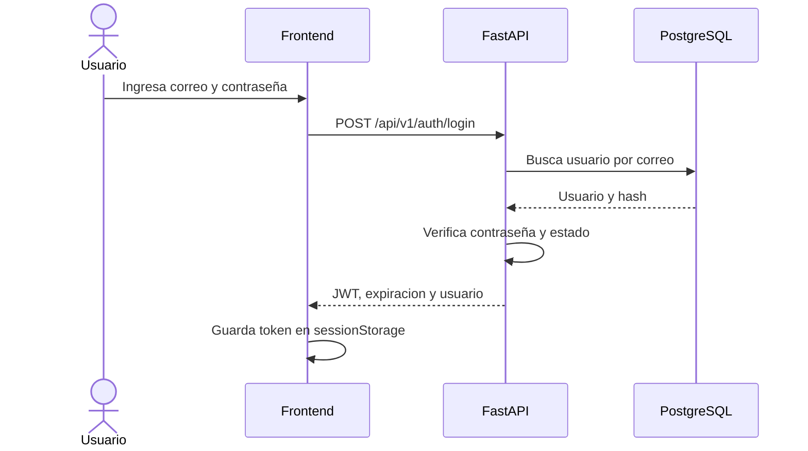

# Fase 02 - Autenticacion y permisos

## 1. Objetivo

Este documento define como se identificaran los usuarios y como se controlara el
acceso a los modulos de SalesIA Enterprise. La implementacion se realizara en la
fase 05 y los controles avanzados se reforzaran en la fase 13.

## 2. Decision de autenticacion

La primera version utilizara correo y contraseña para iniciar sesion. Cuando las
credenciales sean validas, FastAPI entregara un token JWT de acceso.

| Decision | Valor |
| --- | --- |
| Tipo de credencial | Correo y contraseña. |
| Tipo de token | JWT de acceso. |
| Algoritmo de firma | HS256. |
| Duracion | 30 minutos. |
| Renovacion automatica | No incluida en la primera version. |
| Transporte | Encabezado `Authorization: Bearer <token>`. |
| Almacenamiento frontend | `sessionStorage`. |
| Cierre de sesion | Eliminar el token del navegador. |

Al vencer el token, el usuario debe iniciar sesion nuevamente. Esta decision
evita incorporar refresh tokens y revocacion de sesiones antes de necesitarlos.

## 3. Contenido del token

El JWT contendra solamente la informacion necesaria:

| Claim | Proposito |
| --- | --- |
| `sub` | Identificador del usuario representado como texto. |
| `iat` | Momento de emision. |
| `exp` | Momento de expiracion. |
| `jti` | Identificador unico del token. |

El rol no sera la unica fuente de autorizacion dentro del token. En cada
solicitud protegida, el backend cargara al usuario actual desde PostgreSQL y
comprobara que siga activo y que conserve el rol requerido. Asi, desactivar un
usuario o cambiar su rol tiene efecto sin esperar al vencimiento del token.

No se incluyen contraseña, datos personales del cliente ni secretos en el JWT.

## 4. Contraseñas

- Las contraseñas se almacenaran mediante hash Argon2id.
- Se utilizara `pwdlib` con soporte Argon2.
- Nunca se guardaran ni registraran contraseñas en texto plano.
- La longitud inicial permitida sera de 12 a 128 caracteres.
- No se impondran reglas artificiales de mayusculas o simbolos.
- El administrador podra asignar una nueva contraseña a otro usuario.
- Recuperacion por correo y cambio autonomo de contraseña quedan fuera de la
  primera version.

Cuando falle el inicio de sesion, la respuesta sera generica y no indicara si el
correo existe.

## 5. Flujo de inicio de sesion

Si las credenciales son incorrectas se devuelve `401 INVALID_CREDENTIALS`. Si
el usuario esta desactivado se devuelve `403 USER_INACTIVE`.

## 6. Flujo de una solicitud protegida

1. El frontend lee el token de `sessionStorage`.
2. Envia `Authorization: Bearer <token>`.
3. FastAPI verifica firma, formato y vencimiento.
4. El backend obtiene `sub` y carga el usuario desde PostgreSQL.
5. Comprueba que el usuario exista y este activo.
6. Comprueba que el rol permita la operacion.
7. Ejecuta el caso de uso o devuelve un error controlado.

Un token invalido o vencido produce `401 INVALID_TOKEN`. Un usuario valido sin
el rol necesario produce `403 FORBIDDEN`.

## 7. Roles

Los identificadores internos de rol son:

- `administrator`
- `seller`
- `manager`

La interfaz puede mostrar Administrador, Vendedor y Gerente, pero la API utiliza
los identificadores internos en ingles.

## 8. Matriz de permisos

| Recurso u operacion | Administrador | Vendedor | Gerente |
| --- | --- | --- | --- |
| Iniciar y cerrar sesion | Si | Si | Si |
| Consultar sesion propia | Si | Si | Si |
| Gestionar usuarios | Si | No | No |
| Consultar clientes | Si | Si | Si |
| Crear o actualizar clientes | Si | No | No |
| Consultar categorias y productos | Si | Si | Si |
| Crear o actualizar categorias y productos | Si | No | No |
| Consultar existencias | Si | Si | Si |
| Consultar movimientos de inventario | Si | No | Si |
| Registrar movimientos manuales | Si | No | No |
| Registrar ventas | Si | Si | No |
| Consultar todas las ventas | Si | No | Si |
| Consultar ventas propias | Si | Si | Si |
| Consultar dashboard | Si | No | Si |

Para un vendedor, la API aplica automaticamente el identificador del usuario al
consultar ventas. Enviar otro `seller_id` no permite acceder a ventas ajenas.

## 9. Manejo del token en el frontend

- El token se guarda en `sessionStorage`, no en `localStorage`.
- Se elimina al cerrar sesion o cerrar la pestaña.
- El cliente HTTP agrega el encabezado `Authorization` a solicitudes protegidas.
- Una respuesta `401` elimina la sesion local y dirige al inicio de sesion.
- La interfaz puede ocultar opciones segun el rol, pero el backend siempre vuelve
  a comprobar los permisos.
- El token nunca debe aparecer en la URL ni en mensajes de error.

## 10. Variables requeridas

| Variable | Uso |
| --- | --- |
| `SECRET_KEY` | Firmar y verificar tokens. |
| `ACCESS_TOKEN_EXPIRE_MINUTES` | Duracion del token; valor inicial `30`. |

`SECRET_KEY` debe ser aleatoria, mantenerse fuera de Git y cambiar entre
ambientes. Produccion no puede utilizar el valor de ejemplo.

## 11. Controles reservados para la fase 13

- Limitacion de intentos de inicio de sesion.
- Bloqueo temporal por intentos fallidos.
- Registro detallado de eventos de seguridad.
- Revocacion centralizada de sesiones.
- Refresh tokens, si el uso real los justifica.
- Recuperacion de contraseña.
- Politicas de rotacion de secretos.
- Encabezados avanzados de seguridad y politica CSP.

## 12. Criterios de aceptacion

- El mecanismo de autenticacion esta definido sin implementar codigo.
- El contenido y duracion del JWT estan definidos.
- La contraseña tiene algoritmo y reglas de almacenamiento definidos.
- Los tres roles tienen una matriz de permisos verificable.
- Las respuestas `401` y `403` tienen significados distintos.
- La desactivacion o cambio de rol se comprueba contra la base de datos.
- Los controles avanzados estan asignados a la fase 13.

## 13. Referencia tecnica

- [FastAPI - OAuth2, JWT y hash de contraseñas](https://fastapi.tiangolo.com/tutorial/security/oauth2-jwt/)
