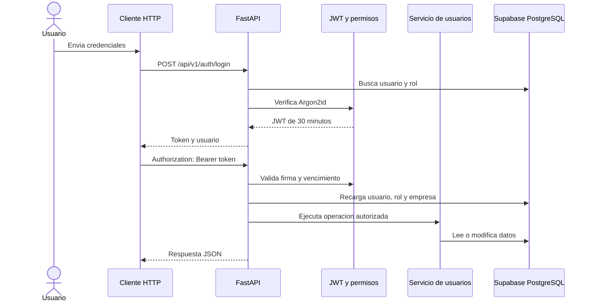

# Fase 05 - Backend y API FastAPI

## 1. Alcance implementado

La fase 05 convierte la estructura tecnica del backend en una API ejecutable y
conectada a PostgreSQL/Supabase. En esta fase quedan completos los componentes
comunes, la autenticacion y la administracion de usuarios.

Los servicios comerciales reutilizaran esta base en las fases 07 y 08. No se
publican endpoints parcialmente funcionales para clientes, productos,
inventario o ventas.

## 2. Flujo de una solicitud protegida



El rol no se considera confiable por estar en el navegador ni se guarda dentro
del JWT. Cada solicitud vuelve a consultar al usuario para que un cambio de rol
o una desactivacion tenga efecto inmediato.

## 3. Endpoints implementados

| Metodo | Endpoint | Acceso | Funcion |
| --- | --- | --- | --- |
| GET | `/health` | Publico | Estado del proceso |
| GET | `/health/ready` | Publico | Comprueba conexion con PostgreSQL |
| POST | `/api/v1/auth/login` | Publico | Valida credenciales y entrega JWT |
| GET | `/api/v1/auth/me` | Autenticado | Devuelve la sesion vigente |
| GET | `/api/v1/users` | Administrador | Lista paginada y filtros |
| POST | `/api/v1/users` | Administrador | Crea un usuario con hash Argon2id |
| GET | `/api/v1/users/{id}` | Administrador | Consulta un usuario |
| PATCH | `/api/v1/users/{id}` | Administrador | Actualiza datos, rol, estado o contraseña |

No existe `DELETE`: los usuarios se desactivan y el historial se conserva.

## 4. Seguridad aplicada

- Hash de contraseñas con Argon2id mediante `pwdlib`.
- Longitud de contraseña entre 12 y 128 caracteres.
- JWT HS256 con `sub`, `iat`, `exp` y `jti`.
- Duracion configurable; valor inicial 30 minutos.
- Tokens sin contraseña, correo, rol ni datos comerciales.
- Autorizacion Bearer en Swagger/OpenAPI.
- Validacion de usuario, rol y empresa en cada solicitud.
- Mensaje generico para correo inexistente o contraseña incorrecta.
- Verificacion de contraseña simulada para correos inexistentes.
- `SECRET_KEY` persistente, aleatoria y fuera de Git.
- CORS limitado a los origenes configurados.
- Contraseñas ocultas por `SecretStr` y excluidas de errores.

Los controles de fuerza bruta, revocacion central y refresh tokens permanecen en
la fase 13.

## 5. Errores uniformes

Los errores de aplicacion, autenticacion, HTTP y validacion usan:

```json
{
  "error": {
    "code": "INVALID_CREDENTIALS",
    "message": "El correo o la contraseña son incorrectos",
    "details": {}
  }
}
```

Los errores inesperados se registran en el backend y devuelven
`INTERNAL_ERROR` sin filtrar trazas ni secretos.

## 6. Ejecucion local

Desde `backend/`:

```powershell
uv sync --dev
uv run python scripts/configure_local_secret.py
uv run uvicorn app.main:app --reload
```

Direcciones:

- API: `http://127.0.0.1:8000`
- Swagger: `http://127.0.0.1:8000/docs`
- ReDoc: `http://127.0.0.1:8000/redoc`
- OpenAPI: `http://127.0.0.1:8000/openapi.json`

Para usar Swagger, ejecutar `/auth/login`, copiar `access_token`, pulsar
**Authorize** y pegar solamente el token.

## 7. Limites con las siguientes fases

| Trabajo | Fase |
| --- | --- |
| Conectar React y administrar la sesion en el navegador | 06 |
| CRUD real de clientes, categorias y productos | 07 |
| Ventas, pagos, movimientos y control transaccional de stock | 08 |
| Calculos estadisticos | 09 |
| Seguridad avanzada y auditoria automatica | 13 |

