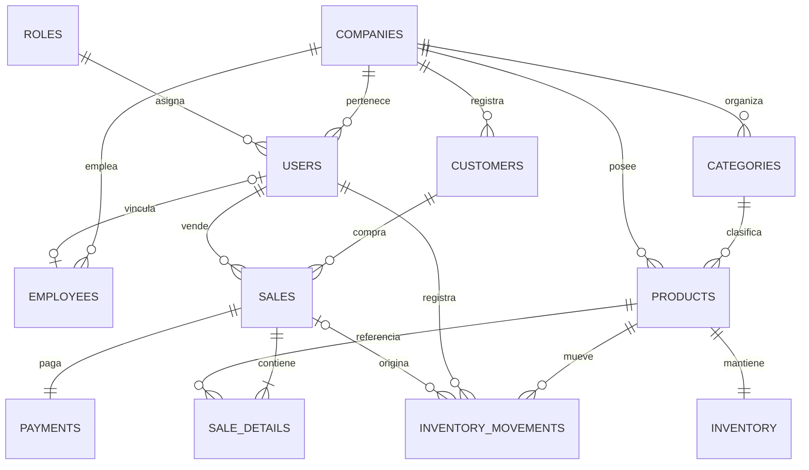
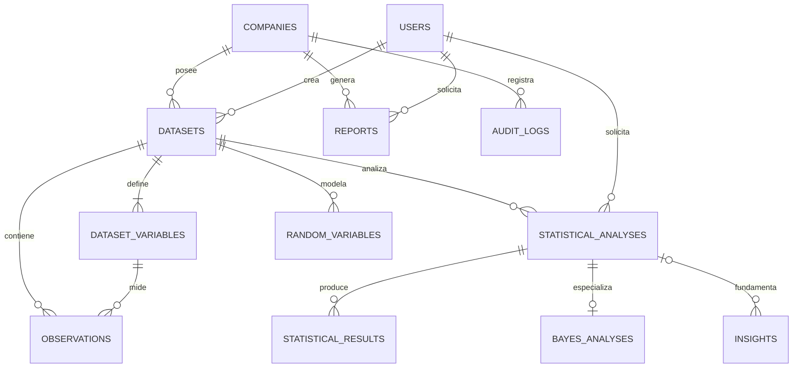

# Fase 04 - Modelo entidad-relacion

## 1. Estado y alcance

El modelo implementa PostgreSQL mediante SQLAlchemy 2 y una migracion inicial
de Alembic. Supabase funciona como proveedor administrado de PostgreSQL; no
reemplaza el modelo ni las migraciones.

El esquema contiene 22 tablas. Las tablas comerciales soportan la primera
version y las tablas analiticas reservan la persistencia exigida por el plan sin
adelantar la logica de las fases 09 a 13.

## 2. Vista de dominios

| Dominio | Tablas |
| --- | --- |
| Organizacion y acceso | `companies`, `roles`, `users`, `employees` |
| Clientes y catalogo | `customers`, `categories`, `products` |
| Inventario | `inventory`, `inventory_movements` |
| Ventas | `sales`, `sale_details`, `payments` |
| Analitica | `datasets`, `dataset_variables`, `observations`, `statistical_analyses`, `statistical_results`, `bayes_analyses`, `random_variables`, `insights` |
| Gobierno | `reports`, `audit_logs` |

## 3. Diagrama principal

## 4. Diagrama analitico

## 5. Decisiones de integridad

- Los identificadores de las entidades son enteros generados por PostgreSQL.
- Los importes utilizan `NUMERIC(14,2)`; no se usa `float` para dinero.
- Cada venta conserva copias del SKU, producto y categoria vendidos para que un
  cambio posterior del catalogo no altere el historial analitico.
- `idempotency_key` y `request_hash` permiten detectar solicitudes repetidas o
  reutilizadas con contenido distinto.
- El stock actual nunca puede ser negativo y cada movimiento guarda stock antes
  y despues.
- Una salida de tipo `sale` exige una venta asociada; los movimientos manuales
  no pueden simular una salida de venta.
- DNI y RUC se validan por tipo y longitud desde PostgreSQL.
- Correo de usuario y nombre de categoria son unicos sin distinguir mayusculas.
- La base rechaza precios, cantidades, subtotales y probabilidades fuera de sus
  rangos validos.
- Las claves foraneas comerciales usan `RESTRICT` para impedir que se borre
  historial. Las estructuras analiticas dependientes usan `CASCADE` solo donde
  forman una unidad descartable.

## 6. Seguridad para Supabase

La migracion habilita Row Level Security en las 22 tablas y no crea politicas
para `anon` o `authenticated`. Por ello, el Data API de Supabase queda cerrado
por defecto y el navegador no accede a las tablas. FastAPI usa una conexion
PostgreSQL privada y es el unico punto de entrada de la aplicacion.

No se utiliza Supabase Auth en esta fase. La autenticacion JWT propia definida
en la fase 02 se implementara en la fase 05.

