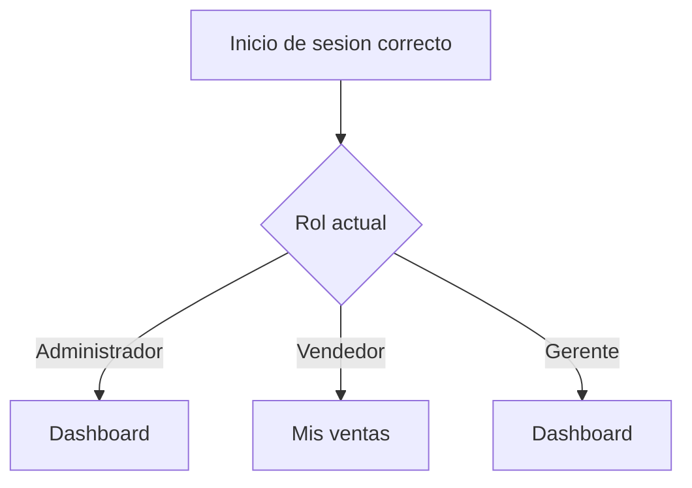
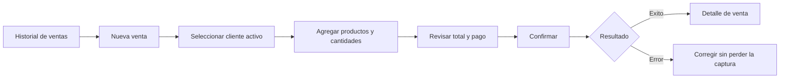
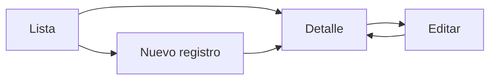

# Fase 03 - Mapa de pantallas y navegacion

## 1. Control del documento

| Campo | Valor |
| --- | --- |
| Proyecto | SalesIA Enterprise |
| Fase | 03 - UX/UI |
| Entregable | Mapa de pantallas y navegacion |
| Alcance | Primera version del sistema |
| Estado | Completo - validado para cierre de fase 03 |
| Origen | Requisitos de fase 01 y permisos de fase 02 |

## 2. Objetivo

Definir las pantallas que necesita la primera version, como se relacionan y que
puede ver cada rol antes de diseñar los formularios y componentes visuales.

Este documento describe la experiencia esperada. Las rutas reales de React y
la autorizacion se implementaran en las fases correspondientes. Ocultar una
opcion en la interfaz no sustituye la comprobacion de permisos del backend.

## 3. Principios de navegacion

- La barra lateral muestra solamente opciones permitidas para el usuario.
- Cada rol entra en una pantalla inicial que puede consultar.
- La cabecera muestra el nombre, el rol y la accion de cerrar sesion.
- Las acciones principales aparecen con nombres directos, por ejemplo `Nueva
  venta` o `Nuevo cliente`.
- Los registros con historial se desactivan; no se presenta una accion para
  eliminarlos definitivamente.
- Una venta confirmada puede consultarse, pero no editarse ni eliminarse.
- Las pantallas de consulta no muestran botones que el rol no puede utilizar.
- En computadoras y tabletas se conserva el mismo orden de navegacion.

## 4. Navegacion principal por rol

### 4.1 Administrador

Pantalla inicial: **Dashboard**.

Orden de la barra lateral:

1. Dashboard.
2. Ventas.
3. Clientes.
4. Productos.
5. Inventario.
6. Usuarios.

El administrador puede crear, consultar, actualizar o desactivar los registros
permitidos por los requisitos. La gestion de categorias se abre desde
`Productos` y no ocupa una opcion adicional en la barra lateral.

### 4.2 Vendedor

Pantalla inicial: **Mis ventas**.

Orden de la barra lateral:

1. Ventas.
2. Clientes.
3. Productos.
4. Inventario.

Dentro de `Ventas` se muestra como accion principal `Nueva venta`. El vendedor
solo consulta clientes activos, productos activos, existencias y ventas
registradas por el mismo. No puede abrir formularios de mantenimiento.

### 4.3 Gerente

Pantalla inicial: **Dashboard**.

Orden de la barra lateral:

1. Dashboard.
2. Ventas.
3. Clientes.
4. Productos.
5. Inventario.

Todas estas pantallas son de consulta. El gerente puede revisar ventas de todos
los vendedores, movimientos de inventario y el resumen comercial, pero no ve
acciones para crear, actualizar, desactivar o ajustar registros.

## 5. Matriz de visibilidad

Leyenda: **Gestionar** incluye las acciones de alta y actualizacion autorizadas;
**Consultar** presenta informacion sin acciones de modificacion.

| Opcion o accion | Administrador | Vendedor | Gerente |
| --- | --- | --- | --- |
| Dashboard comercial | Consultar | No visible | Consultar |
| Historial de ventas | Todas | Propias | Todas |
| Registrar venta | Si | Si | No visible |
| Detalle de venta | Consultar | Solo propias | Consultar |
| Clientes | Gestionar | Consultar activos | Consultar |
| Productos | Gestionar | Consultar activos | Consultar |
| Categorias | Gestionar | Consultar como dato del producto | Consultar como dato del producto |
| Existencias | Consultar | Consultar | Consultar |
| Movimientos de inventario | Consultar | No visible | Consultar |
| Registrar entrada o ajuste | Si | No visible | No visible |
| Usuarios | Gestionar | No visible | No visible |
| Cerrar sesion | Si | Si | Si |

## 6. Inventario de pantallas

### 6.1 Acceso y sesion

| ID | Pantalla | Proposito | Roles |
| --- | --- | --- | --- |
| AU-01 | Iniciar sesion | Capturar correo y contraseña y comunicar errores de acceso. | Publica |
| AU-02 | Sesion vencida | Informar que la sesion termino y regresar al inicio de sesion. | Todos |

La primera version no incluye registro publico, recuperacion por correo ni
cambio autonomo de contraseña.

### 6.2 Dashboard

| ID | Pantalla | Proposito | Roles |
| --- | --- | --- | --- |
| DA-01 | Resumen comercial | Consultar ventas, ingresos, ticket promedio, productos vendidos, productos mas vendidos y ventas recientes por rango de fechas. | Administrador, gerente |

El dashboard es informativo. No incluye estadistica avanzada, probabilidad,
predicciones ni insights automaticos.

### 6.3 Ventas

| ID | Pantalla | Proposito | Roles |
| --- | --- | --- | --- |
| VE-01 | Historial de ventas | Buscar y filtrar ventas por numero, cliente, vendedor, fecha y estado segun el rol. | Todos |
| VE-02 | Nueva venta | Seleccionar cliente, agregar productos, indicar cantidades, revisar totales, elegir el metodo de pago y confirmar. | Administrador, vendedor |
| VE-03 | Detalle de venta | Consultar cliente, vendedor, fecha, lineas, precios aplicados, pago, total y estado. | Todos, respetando el alcance de ventas del rol |
| VE-04 | Confirmacion de venta | Revisar el resumen final y confirmar una sola vez el registro. | Administrador, vendedor |
| VE-05 | Resultado de venta | Informar si la venta fue registrada o explicar el error sin dejar datos parciales. | Administrador, vendedor |

No se presentan acciones para editar, eliminar, anular o devolver una venta
confirmada.

### 6.4 Clientes

| ID | Pantalla | Proposito | Roles |
| --- | --- | --- | --- |
| CL-01 | Lista de clientes | Buscar, filtrar y consultar clientes. | Todos |
| CL-02 | Nuevo cliente | Registrar una persona con DNI o una empresa con RUC. | Administrador |
| CL-03 | Detalle de cliente | Consultar los datos completos y el estado. | Todos |
| CL-04 | Editar cliente | Actualizar datos o cambiar el estado sin borrar su historial. | Administrador |

El vendedor solo puede seleccionar clientes activos durante una venta.

### 6.5 Productos y categorias

| ID | Pantalla | Proposito | Roles |
| --- | --- | --- | --- |
| PR-01 | Lista de productos | Buscar, filtrar y consultar codigo, nombre, categoria, precio, existencia y estado. | Todos |
| PR-02 | Nuevo producto | Registrar los datos comerciales del producto. | Administrador |
| PR-03 | Detalle de producto | Consultar datos, estado y existencia actual. | Todos |
| PR-04 | Editar producto | Actualizar datos, precio, categoria o estado. | Administrador |
| CA-01 | Gestion de categorias | Listar, crear, editar y desactivar categorias desde Productos. | Administrador |

El stock inicial se registra mediante un movimiento de inventario y no como una
edicion directa del valor de existencia en el formulario del producto.

### 6.6 Inventario

| ID | Pantalla | Proposito | Roles |
| --- | --- | --- | --- |
| IN-01 | Existencias | Consultar la cantidad disponible de cada producto. | Todos |
| IN-02 | Movimientos | Consultar entradas, ajustes y salidas producidas por ventas. | Administrador, gerente |
| IN-03 | Nuevo movimiento | Registrar stock inicial, una entrada o un ajuste autorizado con su motivo. | Administrador |
| IN-04 | Detalle de movimiento | Consultar producto, tipo, cantidad, fecha, responsable, motivo y venta relacionada cuando corresponda. | Administrador, gerente |

La primera version no incluye alertas automaticas ni transferencias entre
almacenes.

### 6.7 Usuarios

| ID | Pantalla | Proposito | Roles |
| --- | --- | --- | --- |
| US-01 | Lista de usuarios | Buscar y consultar usuarios, roles y estados. | Administrador |
| US-02 | Nuevo usuario | Registrar un usuario y asignarle Administrador, Vendedor o Gerente. | Administrador |
| US-03 | Detalle y edicion | Actualizar datos, rol o estado y asignar una nueva contraseña. | Administrador |

No existe registro publico de usuarios. Los roles Analista y Almacen quedan
reservados para versiones posteriores.

## 7. Rutas conceptuales

Estas direcciones sirven como contrato de navegacion para el diseño. Su
implementacion con React Router corresponde a la fase de frontend.

| Ruta | Pantalla |
| --- | --- |
| `/login` | AU-01 Iniciar sesion |
| `/dashboard` | DA-01 Resumen comercial |
| `/ventas` | VE-01 Historial de ventas |
| `/ventas/nueva` | VE-02 Nueva venta |
| `/ventas/:id` | VE-03 Detalle de venta |
| `/clientes` | CL-01 Lista de clientes |
| `/clientes/nuevo` | CL-02 Nuevo cliente |
| `/clientes/:id` | CL-03 Detalle de cliente |
| `/clientes/:id/editar` | CL-04 Editar cliente |
| `/productos` | PR-01 Lista de productos |
| `/productos/nuevo` | PR-02 Nuevo producto |
| `/productos/:id` | PR-03 Detalle de producto |
| `/productos/:id/editar` | PR-04 Editar producto |
| `/productos/categorias` | CA-01 Gestion de categorias |
| `/inventario` | IN-01 Existencias |
| `/inventario/movimientos` | IN-02 Movimientos |
| `/inventario/movimientos/nuevo` | IN-03 Nuevo movimiento |
| `/inventario/movimientos/:id` | IN-04 Detalle de movimiento |
| `/usuarios` | US-01 Lista de usuarios |
| `/usuarios/nuevo` | US-02 Nuevo usuario |
| `/usuarios/:id` | US-03 Detalle y edicion |

## 8. Flujos principales

### 8.1 Entrada segun el rol

Si el usuario intenta abrir una direccion sin permiso, la interfaz presenta una
pantalla de acceso denegado y ofrece volver a una opcion permitida.

### 8.2 Registro de una venta

### 8.3 Mantenimiento de registros

Las acciones `Nuevo` y `Editar` solo aparecen cuando el rol cuenta con permiso.

## 9. Elementos reservados para fases posteriores

No deben aparecer en la navegacion activa de la primera version:

- Analytics y estadistica avanzada.
- Probabilidad y Teorema de Bayes.
- Insights automaticos.
- Reportes avanzados y exportacion.
- Pedidos y cotizaciones.
- Facturacion electronica.
- Alertas automaticas de stock.
- Multiples empresas, locales o almacenes.

Las carpetas tecnicas existentes pueden conservarse como reserva sin exponer
estas funciones a los usuarios.

## 10. Criterios de aceptacion

- Cada pantalla corresponde a una necesidad aprobada en la fase 01.
- Administrador, vendedor y gerente tienen una pantalla inicial permitida.
- La visibilidad de menus y acciones coincide con la matriz de permisos de la
  fase 02.
- El vendedor no puede consultar ventas ajenas.
- El gerente no ve acciones que modifiquen operaciones.
- Una venta confirmada no ofrece edicion ni eliminacion.
- Usuarios y categorias forman parte del mapa de la primera version.
- Los modulos futuros no aparecen en la navegacion activa.
- El mapa contempla computadoras y tabletas sin agregar alcance movil.

## 11. Documentos relacionados

- Los campos, controles, validaciones y confirmaciones se encuentran en
  [Diseño de formularios](fase-03-formularios.md).
- Los tokens, componentes y estados se encuentran en
  [Sistema visual](fase-03-sistema-visual.md).
- La estructura de cada pantalla se encuentra en
  [Wireframes](fase-03-wireframes.md).
- La verificacion final se encuentra en
  [Cierre de la fase 03](fase-03-cierre.md).
